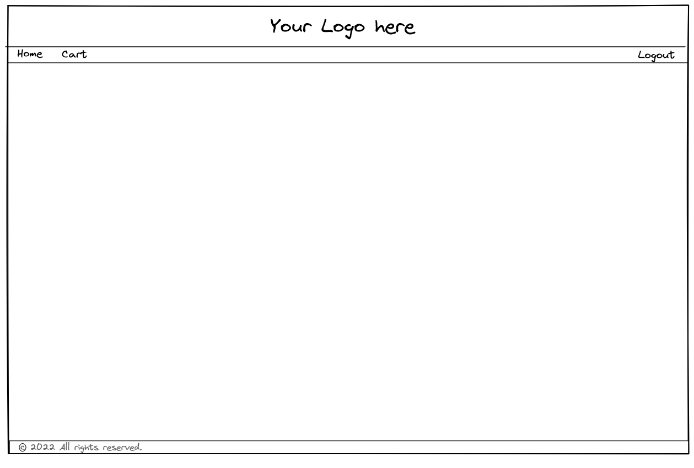
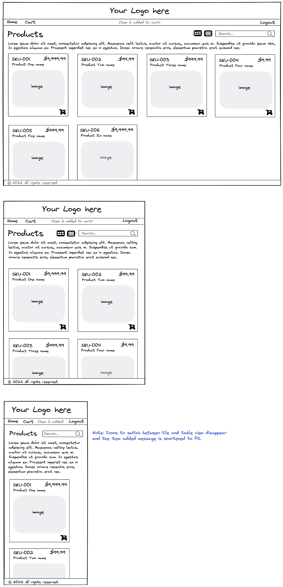
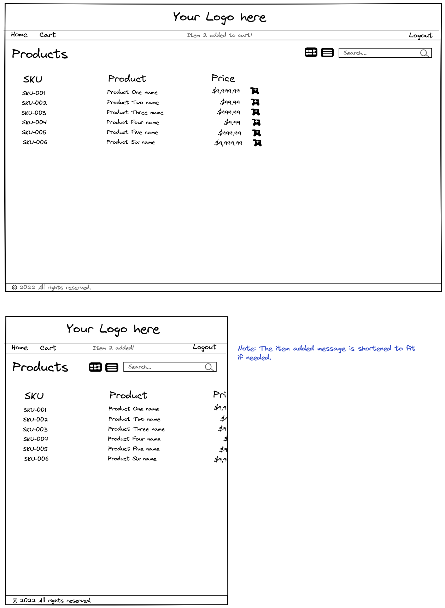
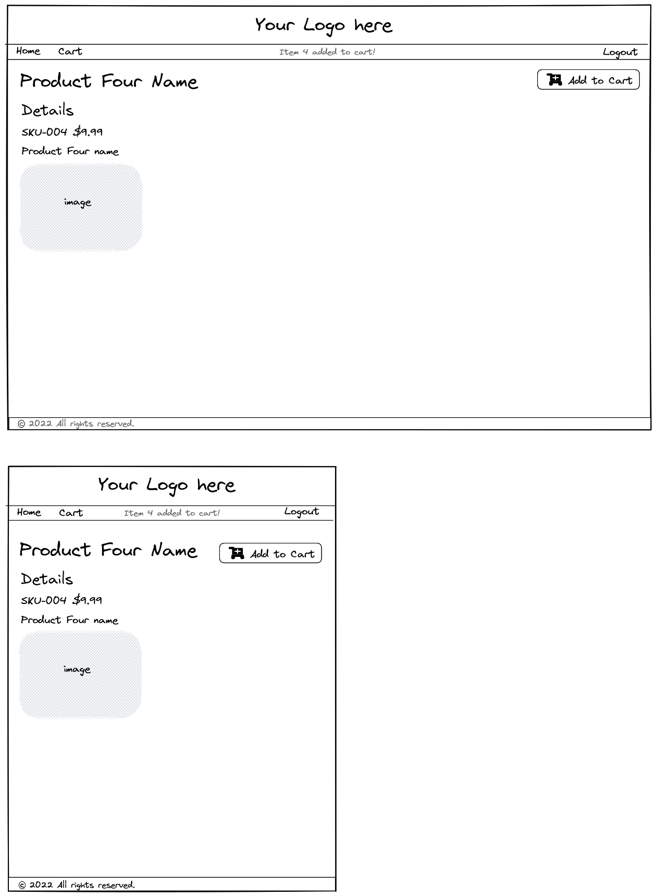
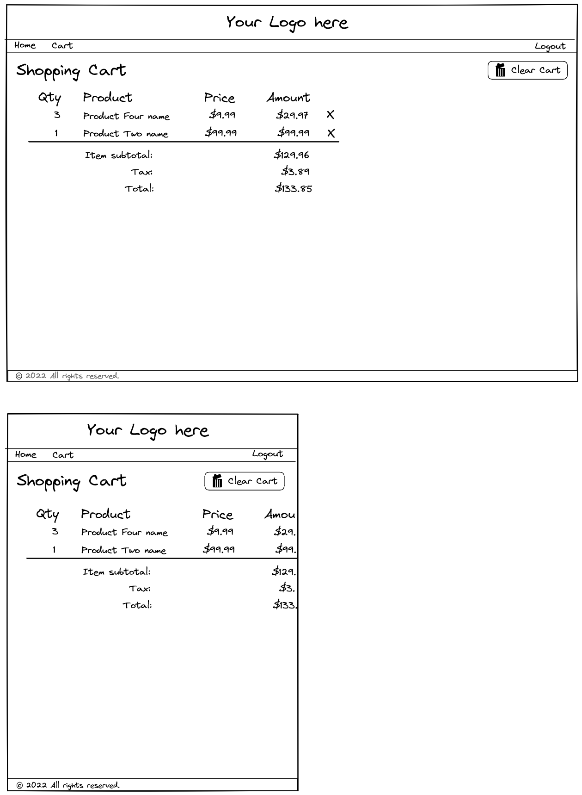

# Module Three final project

The Module Three final project is an opportunity to apply the programming skills and knowledge you've learned in this module. In particular, you'll demonstrate the following:

* Creating HTML and use of semantic elements
* CSS styling and layout with grid and flexbox
* DOM manipulation
* Event handling and listeners
* Accessing data from an API
* Creating components in Vue
* Using Vue Router to create a single-page application (SPA)

## Application

In this project you'll build a Vue front-end to the Solar System Geeks online store. You'll integrate this work with the API that you developed for your Module 2 end-of-module project.

You may use the HTML and CSS from your Module 3 mid-module project, which built a smaller front-end for the Solar System Geeks store using vanilla JavaScript.

## API

Begin by opening the Module Two final project in IntelliJ and reviewing the code. Go to `src/main/resources/application.properties` of your Java project and confirm that the `server.port` setting has the value of 9000:

```conf
server.port=9000
```

There's a script in the `database` folder to create and populate a database. It's the same script you ran for the Module Two final project, so if you created the database for that project, you won't need to create it again.

Run the Java application as it provides the API for the Vue front-end that you're about to construct.

If you don't have a working version of the Module Two final project, you can use the one in the `server` folder of this starter project.

### Review the API

You'll want to re-familiarize yourself with the API you created previously. One way to do this is with Postman request collection, located in the `postman` folder. Import that collection into Postman if it's not already there, and run each request to recall how the API serves data.

## Front-end

Open the `client` folder in Visual Studio Code.

Take a moment to review the `.env` file that's located in the root of the project. You can store environment variables that you want to use throughout your application in this file. When you open it, you'll see a variable that stores the URL of the API provided by the Module Two final project:
​
```conf
# Java
VUE_APP_REMOTE_API=http://localhost:9000
```

*Note:* As you previously confirmed, the Java Spring Boot application runs on port 9000 instead of 8080.

Then download any dependencies by running this command:
​
```bash
npm install
```

Finally, start your Vue application with the following command:
​
```bash
npm run serve
```
​
## Authentication
​
When you first run the project and visit the base URL, you're taken to the products page. If you look in `src/router/index.js`, you'll see that the home path redirects to products.

```js
{
  path: '/',
  name: 'home',
  redirect: {name: "products"}
},
{
  path: '/products',
  name: 'products',
  component: ProductsView,
  meta: {
    requiresAuth: false
  }
},
```

You'll also see the following code, which prevents any **anonymous user** from visiting certain routes. An anonymous user is someone who hasn't logged in to the site and therefore doesn't have a token.

This code ensures that when such a user attempts to visit a route that requires authentication, the router instead directs them to the login page:
​
```js
router.beforeEach((to, from, next) => {
  // Determine if the route requires Authentication
  const requiresAuth = to.matched.some(x => x.meta.requiresAuth);

  // If it does and they are not logged in, send the user to "/login"
  if (requiresAuth && store.state.token === '') {
    next("/login");
  } else {
    // Else let them go to their next destination
    next();
  }
});
```

Because the `products` view must be accessible to users not logged in, `requiresAuth` is false. If you need a route which only authenticated user's can visit—such as the shopping cart, you'll want to set `requiresAuth` to `true` for that route. Then if an anonymous user tries to visit the cart by browsing to `/cart`, the application redirects them to the login page.

## Requirements

The product team has collected a list of requirements for you to implement. User stories provide details on who does what in the application. Designers also created wireframes to provide instruction about the layout you are to create.

### User stories

User stories reflect what a particular _actor_ can accomplish in the application. For this application, there are two possible actors:

* Anonymous user: a person who hasn't yet logged into the application.
* Authenticated user: a person who has registered with and logged into the application.

The following list of user stories describes the requirements for this application.

#### Registration and login

* As an anonymous user, I can register a new account.
  * This feature already exists—**you just need to style the registration page**.
* As an anonymous user, I can login using an existing username and password.
  * This feature already exists—**you just need to style the login page**.
* As an authenticated user, I can click "Logout" to logout of the application.
  * After logout, the system redirects me to the Login page.
  * This feature already exists.

#### Products page

* As an anonymous or authenticated user, I can visit the Products page to see all the products in the SSGeek online store.
  * See the wireframes section for details about the Products page.
  * Route `/` and route `/products` both access the Products page.
  * Clicking `Home` on the navigation bar also accesses the Products page.
* As an anonymous or authenticated user, on the Products page, I can view the product list as a tiled view or a table view, by clicking the appropriate icon.
  * See the wireframes for the two types of views.
* As an anonymous or authenticated user, on the Products page, I can type a search term into a Search edit box, and the page displays only the products whose name contains the search term (ignoring case).
* As an anonymous or authenticated user, from the Products page, I can click a product name to go to the Product Details page.
  * Route `/product/n` accesses the Product Details page for the product with id = n.
* **Only as an authenticated user**, from the Products page, I can click a "shopping cart" icon next to the product, and the application adds the product to my cart.
  * As an anonymous user, the "shopping cart" icon isn't shown.
  * When I click the icon, the application adds 1 unit of the item to my cart.
  * If the item is already in my cart, the application adds 1 to the quantity that's already there.
  * The application shows me a message, confirming that it added the item to my cart.

#### Product Details page

* As an anonymous or authenticated user, I can see the details of one product on the Product Details page.
  * See the wireframes section for more information on the Product Details page
  * Route `/product/n` accesses the Product Details page for the product with id = n.
* **Only as an authenticated user**, from the Product Details page, I can click a "shopping cart" button on the page, and the application adds the product to my cart.
  * As an anonymous user, the "shopping cart" button isn't shown.
  * When I click the button, the application adds 1 unit of the item to my cart.
  * If the item is already in my cart, the application adds 1 to the quantity that's already there.
  * The application shows me a message, confirming that it added the item to my cart.

#### Shopping Cart page

* As an authenticated user, I can click the "Cart" link on the navigation bar to visit my shopping cart.
  * See the wireframes section for details about the Shopping Cart page.
  * Route `/cart` accesses my Shopping Cart page.
  * The Shopping Cart page displays the quantity, name, price and extended price (qty * price) of each item in my cart.
  * The Shopping Cart page also displays the subtotal, tax, and total value of the all items in my cart.
* As an authenticated user, from the Shopping Cart page, I can click a product name to go to the Product Details page.
* As an authenticated user, on the Shopping Cart page, I can click an "X" icon next to any item to remove that item from my cart.
  * This removes the item totally, regardless of the quantity that was in the cart.
  * The application recalculates the subtotal, tax, and total amounts and re-displays the cart.
* As an authenticated user, on the Shopping Cart page, I can click a "Clear Cart" button to remove all items from my cart.

### Wireframes

Wireframes give you the basic layout and operation of each page. You're encouraged to style the views and enhance the user experience as you see fit.

#### Basic layout

The overall layout of the application.



The `header` must:
* Display a logo centered on the page
* Always display at the top of the viewport, regardless of the scroll position

If you have a company logo to use, you can use that. If not, you can insert a placeholder image from [Placeholder.com](https://placeholder.com/). For example, to insert a JPEG image with dimensions 700 pixels by 200 pixels, you can include the following image element:

```html

```

The `nav` must:
* Include the following links:
  * `Home` and `Cart`. Make them left-justified. `Home` takes the user to the product list, while `Cart` takes them to their personal shopping cart.
  * `Login/Logout` links. Make them right-justified. Show the appropriate link depending on whether the user is already logged in. Only one of these displays at any given time. These links go to the `login` and `logout` routes.
* Include a message area that's between the "left" nav links (`Home` and `Cart`) and the "right" nav link (`Login` or `Logout`). The message area must only appear when there's a message to display.
* Highlight the active link in the nav bar.

The `main` area must scroll if its content doesn't fit in the available space, while the `header` and `footer` remain in place.

The `footer` must:
* Contain copyright text
* Always display at the bottom of the viewport, regardless of the length of the main section
> *Tip*: You can copy/paste the copyright symbol from here—`©`—or put `&copy;` in your HTML to have the browser render it.

#### Products page

The Products page, Tile view, at various screen widths:


The Products page, Table view, at various screen widths:


The file `views/ProductsView.vue` contains a starter for the Products view page. You'll need to replace its contents with working logic to display products. However, before you do, run the application and view the page. It contains some hints on how to show a "loading" spinner and how to display Font Awesome icons. You're not required to use these features, but they can enhance the user experience.

*Hint*: See [Currency formatting](#currency-formatting) in the Hints section for how to format numbers in JavaScript.

*Hint*: For more information on Font Awesome see [Font Awesome icons](#font-awesome-icons) in the Hints section.

In the Search box, the user can type the search term and press **Enter** to start the search, or the user can type the search term and click the magnifying glass icon to perform the search. The search must be case-insensitive.

If the user isn't logged in, display a paragraph before the product listing that says, "Welcome. You may browse anonymously as much as you wish, but you must Login to add items to your shopping cart." Make the word "Login" in that message a hyperlink to the Login page.

The user can click the Tile or Table icon to switch between the two different views of the products listing.

#### Product Details page

The Product Details page, at various screen widths:


#### Shopping Cart page

The Shopping Cart page, at various screen widths:


## Hints

### Currency formatting

To show the product's price in the proper format, you can use the `Intl.NumberFormat` object. `Intl.NumberFormat` accepts `locale` and `options` as arguments. `locale` specifies the region whose formatting rules you want to use. `options` allows you to specify what type of formatting you want to apply to your number.

For example, to display a value in U.S. Dollars (USD):

```javascript
Intl.NumberFormat(`en-US`, {
        currency: `USD`,
        style: "currency",
    }).format(value);
```

For a more extensive description of the capabilities of `Intl.NumberFormat`, check out [Mozilla's documentation](https://developer.mozilla.org/en-US/docs/Web/JavaScript/Reference/Global_Objects/Intl/NumberFormat).

### Font Awesome icons

**Font Awesome** is an open source provider of icons, many of which you can use for free.

If you recall, the mid-module project had the Font Awesome library imported with a `<link>` tag. While you can still use that method with a Vue application, there are also `npm` packages that provide Font Awesome icons.

This project has packages from `fortawesome`—that's not a typo, it's an open source fork of the Font Awesome library. The usage is very similar, instead of `<i>` tags you use `<font-awesome-icon>`.

Previously, you'd use this code to display a heart icon:

```html
<i class="fa-solid fa-heart"></i>
```

The equivalent code with the `font-awesome-icon` component is:

```html
<font-awesome-icon icon="fa-solid fa-heart" />
```

Notice that the values you used for the `class` attribute are now used for the component's `icon` prop.

You can still use the `class` attribute to provide CSS styling. For example, assume you've created an `action-button` class that you want to add to the icon:

```html
<font-awesome-icon icon="fa-solid fa-heart" class="action-button" />
```

You can find other examples of `<font-awesome-icon>` in the starting code of this project, and the Module 3 Sample Application.

Note that you must import and add icons in `src/main.js`. There you'll see these lines:

```js
import { faCartPlus, faTrashCan, faXmark, faMagnifyingGlass, faRotate, faTable, faGrip }
  from '@fortawesome/free-solid-svg-icons'

library.add(faCartPlus);
library.add(faTrashCan);
// ...
```

To add the heart icon, add `faHeart` to the import:

```js
import { faCartPlus, faTrashCan, faXmark, faMagnifyingGlass, faRotate, faTable, faGrip, faHeart }
  from '@fortawesome/free-solid-svg-icons'
```

And add it to the `library`:

```js
library.add(faCartPlus);
library.add(faTrashCan);
// ...
library.add(faHeart);
```

You can use the [Font Awesome icon search](https://fontawesome.com/search?m=free&o=r) or the [Fort Awesome icon browser](https://fortawesome.com/sets/starter) for icons.

### About favicon

A "favicon" is the small icon that you see on the browser tab when you navigate to a web page or application. When Vue creates a starter project for you, it supplies the familiar Vue "V" icon as your application's favicon. When you run this project, you'll see a different icon—one for the SS Geeks online store. It may interest you how to do this in your own project.

* First you need a very small picture (the SS Geeks favicon is 48 by 48 pixels) in the format of a `.ico` file. There are tools online for creating a `.ico` from a `.jpg` or `.png`.
* In your project, drop the file into the `/public` folder. In this project, the file is `/public/favicon-alien.ico`.
* In `index.html`, in the `<head>` section, add a `link` to the icon file:

```html
<head>
  ... other stuff, like meta tags and title
  <link rel="icon" href="<%= BASE_URL %>favicon-alien.ico">
</head>```
